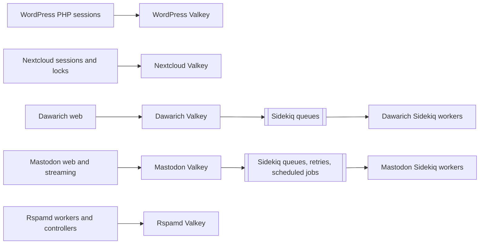

# Valkey deployment and Redis retirement

WordPress, Nextcloud, Dawarich, Mastodon, and Rspamd use repo-native Valkey 9
StatefulSets. Valkey speaks the Redis protocol, so application settings such as
`REDIS_URL`, PHP's `redis` extension, Mastodon's `redis` chart block, the
`mastodon-redis` Secret, and `redis_exporter` remain valid compatibility
names. They are not evidence of a remaining Redis server.

The Redis operator, its CRDs and `ot-operators` namespace are retired. Each
Valkey instance is owned by the same Argo CD Application as its consumer.
Sentinel is not used: every deployment is a single-replica StatefulSet with a
stable Service and Longhorn storage.

## Topology and background queues



WordPress and Nextcloud use Valkey for ephemeral application state. Dawarich
and Mastodon also use it as the durable coordination point for Sidekiq
background queues. Rspamd contains learned and operational data and therefore
requires a data-preserving migration.

All five instances enable AOF and save an RDB snapshot after at least one
change within 60 seconds. Each pod also exposes Redis-compatible metrics through
`redis_exporter`.

## Cutover policy

WordPress and Nextcloud cache/session data may be recreated. Dawarich and
Mastodon queue data was intentionally not imported, so their queues had to be
drained before cutover:

1. Stop web or streaming processes from enqueueing new work.
2. Leave Sidekiq workers running until the active queue and busy counts are
   zero:

   ```sh
   bundle exec rails runner 'puts({queued: Sidekiq::Queue.all.sum(&:size), busy: Sidekiq::Workers.new.size}.inspect)'
   ```

3. Review `Sidekiq::RetrySet` and `Sidekiq::ScheduledSet`; do not silently
   discard important delayed work.
4. Start Valkey, restore application processes, and verify new jobs complete.

Rspamd used a different procedure:

1. Create a filesystem-level backup of the old Redis RDB/AOF data.
2. Stop Rspamd and both database processes so no writes occur during the copy.
3. Copy the persistence files to the dedicated `valkey-mail-lh` PVC and
   verify checksums.
4. Start Valkey, then Rspamd, and verify the key count and persistence health.

## Verification

Check each application rather than relying only on pod readiness:

* WordPress login and session continuity.
* Nextcloud login, file operations, and transactional locking.
* Dawarich ingestion and Sidekiq job completion.
* Mastodon web, streaming, queue, retry, and scheduled-job processing.
* Rspamd key count, history, Bayesian learning, fuzzy storage, and statistics.
* All Valkey exporter targets on port 9121.

For the data-bearing Rspamd instance, also verify:

```sh
kubectl exec -n mail statefulset/valkey -c valkey -- \
  valkey-cli info persistence
kubectl exec -n mail statefulset/valkey -c valkey -- \
  valkey-cli dbsize
```

`aof_enabled` must be `1`, `aof_last_write_status` and
`rdb_last_bgsave_status` must be `ok`, and the key count must be plausible
for the migrated Rspamd dataset.

## Backups and cleanup

The Rspamd PVC `valkey-mail-lh` carries the Longhorn recurring-job labels
`backup-daily-retain31-c` and `trim-daily-c`. Its old Redis PV has reclaim
policy `Retain` as a rollback safeguard.

Use this order when removing Redis leftovers:

1. Confirm every application uses its Valkey Service and remains healthy.
2. Confirm no Redis custom resources exist.
3. Remove the retired Redis Argo CD Applications, operator, network policies,
   CRDs, and `ot-operators` namespace.
4. Wait for the replacement Rspamd volume to complete at least one Longhorn
   backup.
5. Only then delete the released old Redis PV and Longhorn volume.
6. Keep an independent migration backup until the new backup has been tested
   or its restore path has been verified.

Do not remove Argo CD's internal `argocd-redis`, Harbor's `harbor-redis`, or
Redis-compatible environment variables, Secrets, exporter names, and metrics.
Those are active components or public compatibility interfaces, not migration
leftovers.
